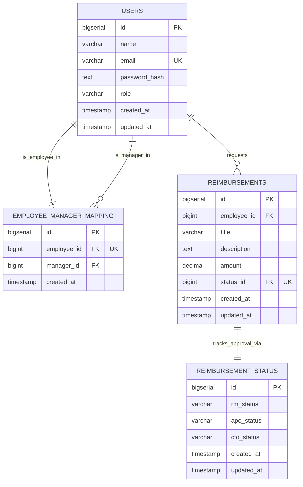

# Entity-Relationship Diagram

```mermaid
erDiagram
    USERS {
        bigserial id PK
        varchar name
        varchar email UK
        text password_hash
        varchar role
        timestamp created_at
        timestamp updated_at
    }

    EMPLOYEE_MANAGER_MAPPING {
        bigserial id PK
        bigint employee_id FK "UK"
        bigint manager_id FK
        timestamp created_at
    }

    REIMBURSEMENT_STATUS {
        bigserial id PK
        varchar rm_status
        varchar ape_status
        varchar cfo_status
        timestamp created_at
        timestamp updated_at
    }

    REIMBURSEMENTS {
        bigserial id PK
        bigint employee_id FK
        varchar title
        text description
        decimal amount
        bigint status_id FK "UK"
        timestamp created_at
        timestamp updated_at
    }

    USERS ||--|| EMPLOYEE_MANAGER_MAPPING : "is_employee_in"
    USERS ||--o{ EMPLOYEE_MANAGER_MAPPING : "is_manager_in"
    
    USERS ||--o{ REIMBURSEMENTS : "requests"
    REIMBURSEMENTS ||--|| REIMBURSEMENT_STATUS : "tracks_approval_via"
```
